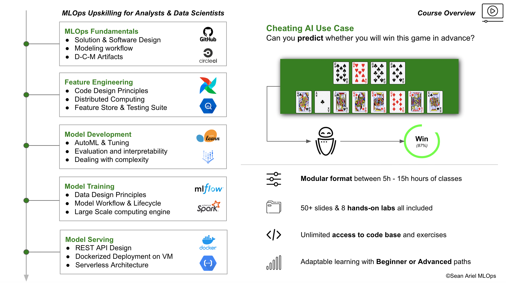

### Hi - I'm Sean.

**Over the last years**, I've worked at top tier companies (BCG Gamma/X, Veepee, Fever Labs) on very interesting problems :
- Adaptive Pricing & ML-based Demand Forecasting
- Large Scale Personalization Systems
- Reinforcement Learning for Next Best Action Modeling

**I'm also the developer** behind [Belote Maniée](https://belotemaniee.com/) - a strategic variant to the classic game of French Belote. I trained 100+ custom AI models (to power the backend of the game) and served it online to make it free and available to anyone interested in strategy games.

**I summed up my main learnings** in a course that will fast track your career as a Machine Learning Engineer by showing you what it takes to build and release an advanced AI system at scale.

### Click The Picture:

#### [Contact Sean Ariel](https://forms.gle/KFgFY2LywDNRVg5b8)
